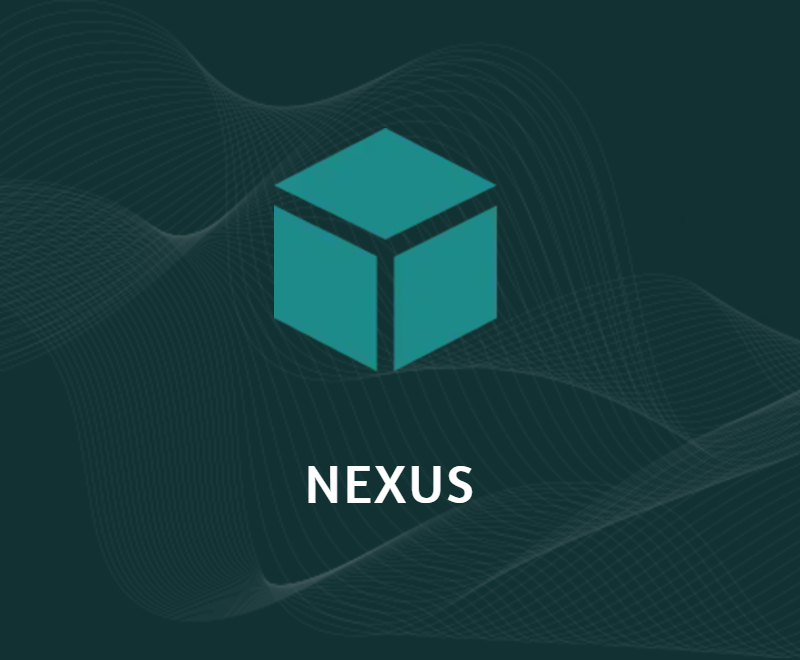

# MrDemonWolf - Custom Divi Child Theme



A custom WordPress child theme built on the Divi Theme
Builder by MrDemonWolf, Inc. It includes pre-built page
layouts, a "Service" custom post type, breadcrumbs,
social sharing, and a migration path for sites previously
running the Nexus Divi child theme.

Your WordPress site, your brand.

## Features

- **Divi Child Theme** - Extends the Divi Theme Builder
  with custom styles, layouts, and components.
- **Service Custom Post Type** - Register and manage
  services with a dedicated icon metabox in the admin.
- **Breadcrumbs Shortcode** - Automatic breadcrumb
  navigation with WooCommerce, project, and archive
  support via `[mrdemonwolf_breadcrumbs]`.
- **Tags Shortcode** - Display post or project tags
  inline with `[mrdemonwolf_tags]`.
- **Social Share Shortcode** - One-click sharing to
  Facebook, X, and LinkedIn via
  `[mrdemonwolf_social_share]`.
- **Video Popup** - Magnific Popup integration for
  lightbox video embeds (bundled locally).
- **Security Hardened** - SVG uploads restricted to
  admins, login error messages obscured, WordPress
  version number hidden, capability checks on all saves.
- **Pre-built Layouts** - Supplementary Divi Builder JSON
  and XML exports for Theme Builder, Library, Theme
  Options, and Customizer settings.
- **Migration Script** - WP-CLI script to migrate an
  existing Nexus-based site to MrDemonWolf with dry-run
  support.

## Getting Started

1. Install and activate the
   [Divi Theme](https://www.elegantthemes.com/gallery/divi/)
   on your WordPress site.
2. Download `mrdemonwolf.zip` from the
   [latest release](https://github.com/mrdemonwolf/mrdemonwolf-wp-theme/releases/latest)
   (or build it from source — see Development below).
3. Go to **Appearance > Themes > Add New > Upload Theme**
   and upload `mrdemonwolf.zip`.
4. Activate the **MrDemonWolf** child theme.
5. Follow the import steps below to load the pre-built
   content and layouts.

## Usage

### Shortcodes

| Shortcode                     | Description                      |
| ----------------------------- | -------------------------------- |
| `[mrdemonwolf_breadcrumbs]`   | Renders breadcrumb navigation    |
| `[mrdemonwolf_tags]`          | Displays current post/project tags |
| `[mrdemonwolf_social_share]`  | Renders social share links       |

### Importing Supplementary Files (Follow This Order)

The `supplementary/` directory contains pre-built Divi
configuration exports. **Import them in this exact order**
to avoid broken references:

1. **All Content** - Go to **Tools > Import > WordPress**
   and upload `All Content.xml`. This creates posts,
   pages, media, and custom post types that the layouts
   reference. When prompted, check "Download and import
   file attachments."
2. **Theme Options** - Go to **Divi > Theme Options >
   Import & Export > Import** and upload
   `MrDemonWolf Divi Theme Options.json`. This sets
   global colors, fonts, button styles, and header/footer
   defaults.
3. **Customizer Settings** - Go to **Divi > Theme
   Customizer > Export & Import > Import** and upload
   `MrDemonWolf Divi Customizer Settings.json`. This
   applies color palette, typography, and spacing
   overrides.
4. **Divi Library** - Go to **Divi > Divi Library >
   Import & Export > Import** and upload
   `MrDemonWolf Divi Library.json`. Check the
   **"Import Presets"** checkbox before importing.
   This loads reusable layout modules and sections.
5. **Theme Builder** - Go to **Divi > Theme Builder >
   Portability > Import** and upload
   `MrDemonWolf Theme Builder.json`. Check the
   **"Import Presets"** checkbox before importing.
   This assigns header, footer, and page templates
   that reference the Library items from step 4.
6. **Reading Settings** - Go to **Settings > Reading**.
   Under "Your homepage displays," select **A static
   page**, set **Homepage** to "Home" and **Posts page**
   to "Blog." Click **Save Changes**.
7. **Menu Assignment** - Go to **Appearance > Menus**.
   Select the "Main Menu" and assign it to the
   **Primary Menu** display location. Click
   **Save Menu**.

### Customizing Colors

The theme uses **Divi Global Colors** (CSS custom
properties) to keep the color palette consistent across all
layouts and components. Changing these values updates every
element that references them.

#### Color Reference

| Variable / Key | Role | Default |
|---|---|---|
| `--gcid-primary-color` / `accent_color` | Primary accent | `#1e8a8a` |
| `--gcid-secondary-color` / `secondary_accent_color` | Secondary accent | `#0c1e21` |
| `--gcid-heading-color` / `header_color` | Heading text | `#0c1e21` |
| `--gcid-body-color` / `font_color` | Body text | `#364e52` |
| `link_color` | Link color | `#1e8a8a` |
| `gcid-qn8h12q0c7` | Background | `#d8e5e5` |
| `gcid-xsweq3oku6` | Light background | `#ecf0f0` |
| `gcid-hhvnnvrog9` | Dark color 2 | `#18292c` |
| `gcid-0ny19batqe` | Text 2 | `#a9b8b8` |

#### Method 1: WordPress Admin

Change colors through the Divi UI — no code required:

- **Visual Builder** > Design Variable Manager > Colors
  tab — edit the Global Color swatches directly.
- **Appearance > Customize > General Settings > Layout
  Settings** — update accent, link, and header/footer
  colors in the Customizer.

### Color Locations

Reference of every brand color and where it lives in the
theme. Use this to know what each rebranding method covers
and what still needs manual work.

#### Palette

| Role | Hex | CSS Variable |
| --- | --- | --- |
| Primary (links, buttons, accents) | `#1e8a8a` | `--gcid-primary-color` |
| Secondary (headings, dark elements) | `#0c1e21` | `--gcid-secondary-color` |
| Body text | `#364e52` | `--gcid-body-color` |
| Background | `#d8e5e5` | `--gcid-qn8h12q0c7` |
| Light BG | `#ecf0f0` | `--gcid-xsweq3oku6` |
| Dark 2 | `#18292c` | `--gcid-hhvnnvrog9` |
| Text 2 | `#a9b8b8` | `--gcid-0ny19batqe` |
| Extra 1 (borders) | `#c9d1d1` | hardcoded |
| Extra 2 (accents) | `#67787a` | hardcoded |
| Extra 3 (dark layout) | `#313d3d` | hardcoded |
| Extra 4 (light accents) | `#e9eded` | hardcoded |

#### Where colors live

1. **Divi Admin UI** — Global Colors in the Design
   Variable Manager, Customizer accent/link/heading colors,
   and per-module overrides in the Visual Builder.
2. **Database (`wp_options`)** — 12 Customizer color keys
   in `et_divi`, 5 global color definitions in
   `et_global_data.global_colors`, and 159+ inline color
   refs in `wp_posts` builder content. Use WP-CLI
   `wp search-replace` to update.
3. **`theme/style.css`** — 30+ usages via `--gcid-*` CSS
   variables (update automatically when global colors
   change). Also contains hardcoded hex values and RGBA
   values that need manual updates (see below).
4. **Supplementary exports (`supplementary/`)** — Theme
   Builder JSON, All Content XML, Divi Library JSON, and
   Customizer Settings JSON. Use find-and-replace to
   update.

#### Manual style.css updates

The following items in `theme/style.css` require manual
find-and-replace when rebranding:

- **Hardcoded hex values** — `#ecf0f0` (5 places),
  `#c9d1d1` (7 places), `#a9b8b8` (1 place),
  `#67787a` (2 places)
- **RGBA values using the primary color** —
  `rgba(30, 138, 138, 0.3)` and
  `rgba(30, 138, 138, 0.15)`
- **URL-encoded colors in SVG data URIs** — e.g.
  `%23ecf0f0` inside `data:image/svg+xml` strings

### Migrating from Nexus

If you are switching from the Nexus Divi Child Theme,
run the included migration script or execute the
commands manually. Requires
[WP-CLI](https://wp-cli.org/).

> **WARNING:** This will overwrite existing Nexus theme
> data in your database. **Back up your database before
> running any of these commands.** Run at your own risk.

#### Option A: Run the script

```bash
# Preview changes (no writes)
./migrate.sh --dry-run

# Apply the migration
./migrate.sh
```

#### Option B: Run the commands manually

```bash
# 1. Shortcodes
wp search-replace "[Nexus_breadcrumbs" "[mrdemonwolf_breadcrumbs" --precise
wp search-replace "[nexus_tags" "[mrdemonwolf_tags" --precise
wp search-replace "[nexus_social_share" "[mrdemonwolf_social_share" --precise

# 2. CSS classes (Divi builder data)
wp search-replace "nexus-" "mdw-" --precise

# 3. Post meta keys
wp db query "UPDATE $(wp db prefix)postmeta SET meta_key = '_mrdemonwolf_service_image' WHERE meta_key = '_nexus_service_image';"

# 4. Options table
wp db query "UPDATE $(wp db prefix)options SET option_name = REPLACE(option_name, 'nexus_', 'mrdemonwolf_') WHERE option_name LIKE 'nexus\_%';"
```

All commands are idempotent and safe to run multiple
times.

## Tech Stack

| Layer       | Technology                        |
| ----------- | --------------------------------- |
| CMS         | WordPress                         |
| Theme       | Divi (parent) + MrDemonWolf (child) |
| Language    | PHP, CSS, JavaScript (jQuery)     |
| Lightbox    | Magnific Popup 1.1.0 (bundled)    |
| Migration   | WP-CLI                            |

## Development

### Prerequisites

- WordPress 6.0+
- Divi Theme (latest version)
- PHP 7.4+
- WP-CLI (for migration script only)

### Setup

1. Clone the repository:

```bash
git clone https://github.com/mrdemonwolf/mrdemonwolf-wp-theme.git
```

2. Symlink or copy the `theme/` directory into your
   WordPress themes directory:

```bash
ln -s /path/to/mrdemonwolf-wp-theme/theme /path/to/wordpress/wp-content/themes/mrdemonwolf
```

3. Activate the theme in wp-admin.

### Building the Zip

To create an installable zip from the repo:

```bash
cd theme && zip -r ../mrdemonwolf.zip . -x "*.DS_Store" && cd ..
```

Tagged releases (`v*`) also build and attach the zip
automatically — see CI/CD below.

### Code Quality

- All PHP functions are prefixed with `mrdemonwolf_`
  to avoid namespace collisions.
- CSS classes use the `mdw-` prefix.
- Nonce verification and capability checks on all
  form handlers.
- SVG uploads restricted to administrators only.
- Translatable strings use the `mrdemonwolf` text
  domain.

## CI/CD

| Workflow | Trigger | What it does |
| -------- | ------- | ------------ |
| **CI** (`ci.yml`) | Push / PR to `main` or `dev` | PHP syntax check, Nexus reference check, zip build |
| **Release** (`release.yml`) | Push of a `v*` tag | Builds `mrdemonwolf.zip` and creates a GitHub Release with the artifact |

## Project Structure

```
mrdemonwolf-wp-theme/
├── .github/workflows/         # CI/CD pipelines
│   ├── ci.yml                 # Lint, validate, and build
│   └── release.yml            # Tagged release publisher
├── theme/                     # WordPress child theme
│   ├── assets/                # Bundled third-party assets
│   │   ├── icon_portfolio.svg
│   │   ├── jquery.magnific-popup.min.js
│   │   └── magnific-popup.min.css
│   ├── functions.php          # Theme functions and shortcodes
│   ├── license.txt            # GPL v2 license
│   ├── screenshot.jpg         # Theme screenshot
│   ├── script.js              # Frontend JavaScript
│   └── style.css              # Theme stylesheet
├── supplementary/             # Divi Builder import files
│   ├── All Content.xml
│   ├── MrDemonWolf Divi Customizer Settings.json
│   ├── MrDemonWolf Divi Library.json
│   ├── MrDemonWolf Divi Theme Options.json
│   └── MrDemonWolf Theme Builder.json
└── migrate.sh                 # WP-CLI migration script
```

## License


## Contact

Have questions or feedback?

- Discord: [Join my server](https://mrdwolf.net/discord)

---

Made with love by [MrDemonWolf, Inc.](https://www.mrdemonwolf.com)
