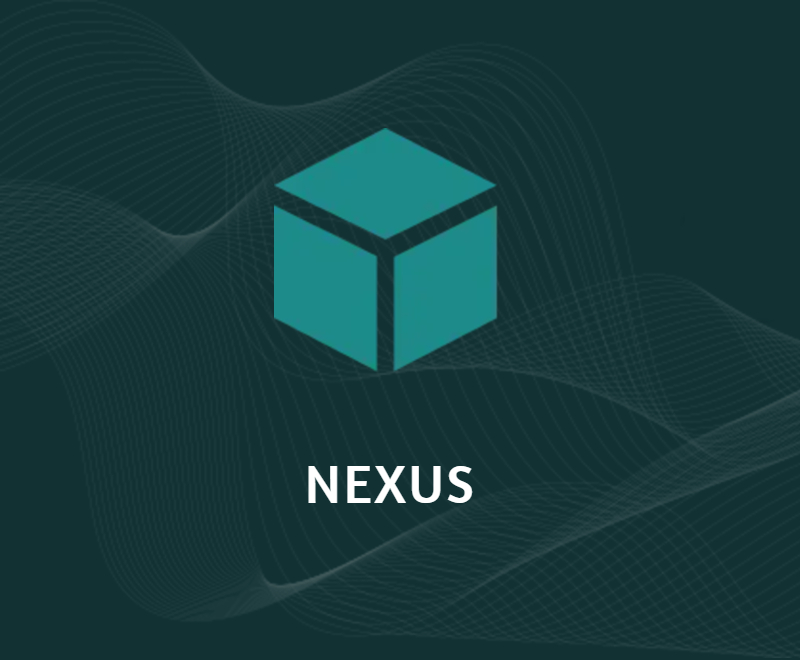

# MrDemonWolf - Custom Divi Child Theme



A custom WordPress child theme built on the Divi Theme
Builder by MrDemonWolf, Inc. It includes pre-built page
layouts, a "Service" custom post type, breadcrumbs,
social sharing, and a migration path for sites previously
running the Nexus Divi child theme.

Your WordPress site, your brand.

## Features

- **Divi Child Theme** - Extends the Divi Theme Builder
  with custom styles, layouts, and components.
- **Service Custom Post Type** - Register and manage
  services with a dedicated icon metabox in the admin.
- **Breadcrumbs Shortcode** - Automatic breadcrumb
  navigation with WooCommerce, project, and archive
  support via `[mrdemonwolf_breadcrumbs]`.
- **Tags Shortcode** - Display post or project tags
  inline with `[mrdemonwolf_tags]`.
- **Social Share Shortcode** - One-click sharing to
  Facebook, X, and LinkedIn via
  `[mrdemonwolf_social_share]`.
- **Video Popup** - Magnific Popup integration for
  lightbox video embeds (bundled locally).
- **Security Hardened** - Login error messages obscured,
  WordPress version number hidden, capability checks on
  all saves.
- **Pre-built Layouts** - Supplementary Divi Builder JSON
  and XML exports for Theme Builder, Library, Theme
  Options, and Customizer settings.
- **Migration Script** - WP-CLI script to migrate an
  existing Nexus-based site to MrDemonWolf with dry-run
  support.

## Getting Started

1. Install and activate the
   [Divi Theme](https://www.elegantthemes.com/gallery/divi/)
   on your WordPress site.
2. Install and activate the
   [SVG Support](https://wordpress.org/plugins/svg-support/)
   plugin for SVG upload and rendering.
3. Download `mrdemonwolf.zip` from the
   [latest release](https://github.com/mrdemonwolf/mrdemonwolf-wp-theme/releases/latest)
   (or build it from source — see Development below).
4. Go to **Appearance > Themes > Add New > Upload Theme**
   and upload `mrdemonwolf.zip`.
5. Activate the **MrDemonWolf** child theme.
6. Follow the import steps below to load the pre-built
   content and layouts.

## Usage

### Shortcodes

| Shortcode                    | Description                        |
| ---------------------------- | ---------------------------------- |
| `[mrdemonwolf_breadcrumbs]`  | Renders breadcrumb navigation      |
| `[mrdemonwolf_tags]`         | Displays current post/project tags |
| `[mrdemonwolf_social_share]` | Renders social share links         |

### Importing Supplementary Files (Follow This Order)

The `supplementary/` directory contains pre-built Divi configuration exports. **Import them in this exact order** to avoid broken references:

1. **Theme Options** - Go to **Divi > Theme Options > Import & Export > Import** and upload `MrDemonWolf Divi Theme Options.json`. This sets global colors, fonts, button styles, and header/footer defaults.
2. **Theme Builder** - Import in two parts:
   - Go to **Divi > Theme Builder > Portability > Import** and upload `MrDemonWolf Divi Theme Builder Layouts.json`. Check **"Override Default Website Template"** and **"Import Presets"** before importing.
   - Then import `MrDemonWolf Divi Theme Builder Templates.json` the same way. This assigns header, footer, and page templates.
3. **Customizer Settings** - Go to **Appearance > Customize > Export & Import > Import** and upload `MrDemonWolf Divi Theme Customizer Settings.json`. This applies color palette, typography, and spacing overrides.
4. **Divi Library** - *This file is not included in the current release. Skip this step.*
5. **All Content** - Go to **Tools > Import > WordPress** and upload `All Content.xml`. This creates posts, pages, media, and custom post types that the layouts reference. When prompted, check "Download and import file attachments."
6. **Reading Settings** - Go to **Settings > Reading**. Under "Your homepage displays," select **A static page**, set **Homepage** to "Home" and **Posts page** to "Blog." Click **Save Changes**.
7. **Menu Assignment** - Go to **Appearance > Menus**. Select the "Main Menu" and assign it to the **Primary Menu** display location. Click **Save Menu**.
8. **WP PageNavi Plugin (Optional)** - Go to **Plugins > Add New** and search for `pagenavi`. Install and activate the **WP-PageNavi** plugin if you want cleaner pagination on your blog and archives.

### Troubleshooting Import

**Service posts show "Invalid post type service":**

The `service` custom post type must be registered before the
importer runs. If you see this error:

1. Confirm **MrDemonWolf** is the active theme
   (Appearance > Themes).
2. Go to **Settings > Permalinks** and click **Save Changes**.
3. Re-run the import — service posts will succeed.

**Media files fail to download:**

The importer fetches attachments over HTTP from the source
site. If files fail, re-run the import with
"Download and import file attachments" checked — it skips
already-imported items and retries only the failures.

### Customizing Colors

The theme uses **Divi Global Colors** (CSS custom
properties) to keep the color palette consistent across all
layouts and components. Changing these values updates every
element that references them.

#### Color Reference

These are the **Nexus vendor defaults**. Every color location and the
rebranding procedure: [COLORS.md](COLORS.md).

| Variable / Key                                      | Role             | Value     |
| --------------------------------------------------- | ---------------- | --------- |
| `accent_color` / `link_color`                       | Accent           | `#1e8a8a` |
| `secondary_accent_color` / `header_color`           | Dark, headings   | `#0c1e21` |
| `font_color`                                        | Body text        | `#364e52` |
| `gcid-xsweq3oku6`                                   | Light background | `#ecf0f0` |
| `gcid-qn8h12q0c7`                                   | Background       | `#d8e5e5` |
| `gcid-hhvnnvrog9`                                   | Dark color 2     | `#18292c` |
| `gcid-0ny19batqe`                                   | Text 2           | `#a9b8b8` |

`theme/style.css` uses `var(--gcid-*)` with **no fallback**, matching the
vendor, so Divi is the single runtime source. The `supplementary/` exports
carry the identical values, verified against the original vendor files.

#### Method 1: WordPress Admin

Change colors through the Divi UI — no code required:

- **Visual Builder** > Design Variable Manager > Colors
  tab — edit the Global Color swatches directly.
- **Appearance > Customize > General Settings > Layout
  Settings** — update accent, link, and header/footer
  colors in the Customizer.

### Color Locations

Reference of every brand color and where it lives in the
theme. Use this to know what each rebranding method covers
and what still needs manual work.

#### Palette

Vendor defaults; [COLORS.md](COLORS.md) is the single source.

| Role                                | Hex       | Set in                        |
| ----------------------------------- | --------- | ----------------------------- |
| Accent                              | `#1e8a8a` | `accent_color`, SVG, `rgba()` |
| Dark / headings                     | `#0c1e21` | `secondary_accent_color`, SVG |
| Body text                           | `#364e52` | `font_color`                  |
| Light background                    | `#ecf0f0` | `--mdw-bg`, `gcid-xsweq3oku6` |
| Background 2                        | `#d8e5e5` | `gcid-qn8h12q0c7`             |
| Dark color 2                        | `#18292c` | `gcid-hhvnnvrog9`             |
| Borders / muted                     | `#c9d1d1` | `--mdw-border`                |
| Muted text / icons                  | `#67787a` | hardcoded + SVG fills         |
| Text 2 / card bg                    | `#a9b8b8` | hardcoded, `gcid-0ny19batqe`  |

#### Where colors live

1. **Divi Admin UI** — Global Colors in the Design
   Variable Manager, Customizer accent/link/heading colors,
   and per-module overrides in the Visual Builder.
2. **Database (`wp_options`)** — 12 Customizer color keys
   in `et_divi`, 5 global color definitions in
   `et_global_data.global_colors`, and 159+ inline color
   refs in `wp_posts` builder content. Use WP-CLI
   `wp search-replace` to update.
3. **`theme/style.css`** — 30+ usages via `--gcid-*` CSS
   variables (update automatically when global colors
   change). Also contains hardcoded hex values and RGBA
   values that need manual updates (see below).
4. **Supplementary exports (`supplementary/`)** — Theme
   Builder JSON, All Content XML, Divi Library JSON, and
   Customizer Settings JSON. Use find-and-replace to
   update.

#### Manual style.css updates

When rebranding, update the hardcoded values in `theme/style.css`:

- **`:root` variables** — `--mdw-bg: #ecf0f0`, `--mdw-border: #c9d1d1`
- **Hardcoded hex values** — `#67787a`, `#a9b8b8`, `#ffffff`
- **RGBA values using the accent** — `rgba(30, 138, 138, 0.3)`,
  `rgba(30, 138, 138, 0.15)`, `rgba(30, 138, 138, 0)`
- **URL-encoded colors in SVG data URIs** —
  `%23ecf0f0` inside `data:image/svg+xml` strings
- **`theme/assets/*.svg` fills** — `#1e8a8a`, `#67787a`, `#0c1e21`

#### Rebranding to Your Own Palette

The theme and the `supplementary/` exports ship the vendor
palette, verified color-for-color against the original
files. Only class names were renamed (`nexus-` to `mdw-`).
Use the table below when rebranding: replace the right
column with your values, then work every location listed in
[COLORS.md](COLORS.md).

| Current (vendor) | Role             | Replace With  | Notes                                            |
| ---------------- | ---------------- | ------------- | ------------------------------------------------ |
| `#1e8a8a`        | Accent           | *your accent* | Also SVG fills and `rgba(30, 138, 138, …)`       |
| `#0c1e21`        | Dark / headings  | *your dark*   | Also an SVG fill                                 |
| `#18292c`        | Dark color 2     | *your dark 2* | `gcid-hhvnnvrog9`                                |
| `#364e52`        | Body text        | *your body*   | `font_color`                                     |
| `#2ea3f2`        | Fixed-nav accent | *your accent* | Divi stock blue; the vendor never changed it     |
| `#ecf0f0`        | Light background | *your light*  | Also `%23ecf0f0` in an SVG data URI              |
| `#c9d1d1`        | Muted border     | *your border* | -                                                |
| `#d8e5e5`        | Background 2     | *your bg 2*   | `gcid-qn8h12q0c7`                                |

**WP-CLI commands** to replace in the database:

```bash
# Replace old Nexus colors in wp_options and wp_posts
wp search-replace "#1e8a8a" "#youraccent" --precise
wp search-replace "#0c1e21" "#yourdark" --precise
wp search-replace "#18292c" "#yourdark2" --precise
wp search-replace "#364e52" "#yourbody" --precise
wp search-replace "#ecf0f0" "#yourlight" --precise
wp search-replace "#c9d1d1" "#yourborder" --precise
wp search-replace "#d8e5e5" "#yourbg2" --precise
```

After running these commands:

- Update any remaining global color swatches in **Divi >
  Design Variable Manager**.
- In `theme/style.css`, update hardcoded values like
  `#ecf0f0`, `rgba(30, 138, 138, ...)` etc. manually in
  code (these are not stored in the database).

### Migrating from Nexus

If you are switching from the Nexus Divi Child Theme,
run the included migration script or execute the
commands manually. Requires
[WP-CLI](https://wp-cli.org/).

> **WARNING:** This will overwrite existing Nexus theme
> data in your database. **Back up your database before
> running any of these commands.** Run at your own risk.

#### Option A: Run the script

```bash
# Preview changes (no writes)
./migrate.sh --dry-run

# Apply the migration
./migrate.sh
```

#### Option B: Run the commands manually

```bash
# 1. Shortcodes
wp search-replace "[Nexus_breadcrumbs" "[mrdemonwolf_breadcrumbs" --precise
wp search-replace "[nexus_tags" "[mrdemonwolf_tags" --precise
wp search-replace "[nexus_social_share" "[mrdemonwolf_social_share" --precise

# 2. CSS classes (Divi builder data)
wp search-replace "nexus-" "mdw-" --precise

# 3. Post meta keys
wp db query "UPDATE $(wp db prefix)postmeta SET meta_key = '_mrdemonwolf_service_image' WHERE meta_key = '_nexus_service_image';"

# 4. Options table
wp db query "UPDATE $(wp db prefix)options SET option_name = REPLACE(option_name, 'nexus_', 'mrdemonwolf_') WHERE option_name LIKE 'nexus\_%';"
```

All commands are idempotent and safe to run multiple
times.

## Tech Stack

| Layer     | Technology                          |
| --------- | ----------------------------------- |
| CMS       | WordPress                           |
| Theme     | Divi (parent) + MrDemonWolf (child) |
| Language  | PHP, CSS, JavaScript (jQuery)       |
| Lightbox  | Magnific Popup 1.1.0 (bundled)      |
| Migration | WP-CLI                              |

> Magnific Popup is pinned to [v1.1.0](https://github.com/dimsemenov/Magnific-Popup/releases/tag/1.1.0) and bundled under `theme/assets/`. To upgrade, replace `jquery.magnific-popup.min.js` and `magnific-popup.min.css` from the upstream release and bump the version string in `theme/functions.php`.

## Development

### Prerequisites

- WordPress 6.5+
- Divi Theme (Divi 5)
- PHP 8.1+
- [SVG Support](https://wordpress.org/plugins/svg-support/) plugin
- WP-CLI (for migration script only)

### Setup

1. Clone the repository:

```bash
git clone https://github.com/mrdemonwolf/mrdemonwolf-wp-theme.git
```

2. Symlink or copy the `theme/` directory into your
   WordPress themes directory:

```bash
ln -s /path/to/mrdemonwolf-wp-theme/theme /path/to/wordpress/wp-content/themes/mrdemonwolf
```

3. Activate the theme in wp-admin.

### Building the Zip

To create an installable zip from the repo:

```bash
cd theme && zip -r ../mrdemonwolf.zip . -x "*.DS_Store" && cd ..
```

Tagged releases (`v*`) also build and attach the zip
automatically — see CI/CD below.

### Code Quality

- All PHP functions are prefixed with `mrdemonwolf_`
  to avoid namespace collisions.
- CSS classes use the `mdw-` prefix.
- Nonce verification and capability checks on all
  form handlers.
- SVG uploads handled by the [SVG Support](https://wordpress.org/plugins/svg-support/) plugin.
- Translatable strings use the `mrdemonwolf` text
  domain.

## CI/CD

| Workflow                    | Trigger                      | What it does                                                            |
| --------------------------- | ---------------------------- | ----------------------------------------------------------------------- |
| **CI** (`ci.yml`)           | Push / PR to `main` or `dev` | PHP 8.1/8.3/8.4 syntax check, PHPCS (WordPress-Core), Nexus reference check, zip build + zip-root check |
| **Release** (`release.yml`) | Push of a `v*` tag           | Verifies `style.css` Version matches the tag, builds `mrdemonwolf.zip`, creates a GitHub Release with the artifact |

### Updating the live site

The theme updates itself from GitHub Releases. `style.css` carries an
`Update URI:` header, and `functions.php` answers WordPress's
`update_themes_github.com` filter with the latest release, so the site shows a
normal theme update in **Appearance > Themes**. No plugin, no deploy keys, no
SFTP.

To ship an update:

1. Bump `Version:` in `theme/style.css`.
2. Add the matching `## [x.y.z]` section to `CHANGELOG.md`.
3. Tag and push:

```bash
git tag v1.1.0 && git push --tags
```

Release CI fails loudly if the header and the tag disagree, or if the changelog
has no entry for that version. On the site, updates appear within 12 hours (the
release check is cached in a transient) or immediately after **Dashboard >
Updates > Check again**.

Caveat: if `DISALLOW_FILE_MODS` is set (some security plugins do this),
WordPress disables all one-click updates. Upload the release zip manually in
that case.

## Project Structure

```
mrdemonwolf-wp-theme/
├── .github/workflows/         # CI/CD pipelines
│   ├── ci.yml                 # Lint, validate, and build
│   └── release.yml            # Tagged release publisher
├── theme/                     # WordPress child theme
│   ├── assets/                # Bundled assets (icons + lightbox)
│   │   ├── icon_arrow_btn.svg
│   │   ├── icon_arrow_btn_2.svg
│   │   ├── icon_arrow_header.svg
│   │   ├── icon_circles.svg
│   │   ├── icon_home.svg
│   │   ├── icon_portfolio.svg
│   │   ├── icon_square.svg
│   │   ├── separator.svg
│   │   ├── jquery.magnific-popup.min.js
│   │   └── magnific-popup.min.css
│   ├── functions.php          # Theme functions and shortcodes
│   ├── license.txt            # GPL v2 license
│   ├── screenshot.jpg         # Theme screenshot
│   ├── script.js              # Frontend JavaScript
│   └── style.css              # Theme stylesheet
├── supplementary/             # Divi Builder import files
│   ├── All Content.xml
│   ├── MrDemonWolf Divi Theme Builder Layouts.json
│   ├── MrDemonWolf Divi Theme Builder Templates.json
│   ├── MrDemonWolf Divi Theme Customizer Settings.json
│   └── MrDemonWolf Divi Theme Options.json
├── CLAUDE.md                  # Claude Code repository guidance
├── DESIGN.md                  # Brand and WP Admin reference
└── migrate.sh                 # WP-CLI migration script
```

## License


## Contact

Have questions or feedback?

- Discord: [Join my server](https://mrdwolf.net/discord)

---

Made with love by [MrDemonWolf, Inc.](https://www.mrdemonwolf.com)
